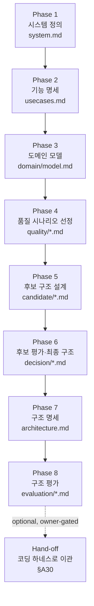

# YSDA Arch Design Standard v1.0.0

> Architecture design mode adapter. All shared rules live in **YSDA Arch Harness Common Core v1.0.0**
> (`ysda-arch-harness-common.md`); this file holds only the **design lifecycle** (§D*). The lifecycle adapts the
> SEI Attribute-Driven Design (ADD) method and the AgentK (`arch-with-ai`) phase structure, and uses arc42/C4 for
> documentation and ATAM-style analysis for evaluation. The product context is **상품화 (productization)**: quality
> attributes — especially **latency and memory** — drive the design, and **design documents precede code**.

---

## D1. Design-first principle
The output of a session is a **design artifact**, not code. The agent must not propose an implementation, a
framework, or a data store before the relevant quality scenarios are prioritized (§D4) and a driver matrix exists
(Common §A8). "Let's just build X" is rejected; "QS-003 (latency p95 ≤ 80 ms) drives us toward X, here are 2
candidates" is the expected shape.

## D2. Lifecycle (8 phases + optional hand-off)
Adapted from AgentK. Each phase produces a named artifact under `arch/` (Common §A7). Phases gate forward: do not
start a phase until the previous phase's artifact exists and passed the Closure Gate (Lite mode may compress, §D3).



- **Phase 1 — 시스템 정의.** `arch/system.md`: 시스템 목적/범위, 비즈니스 드라이버, 이해관계자, 제약, 명시적 Non-Goals(§A16).
- **Phase 2 — 기능 명세.** `arch/usecases.md` + `usecase/UC-nnn.md`: 핵심 use case와 주요 흐름. 망라가 아니라 *구조에 영향을 주는* use case 우선.
- **Phase 3 — 도메인 모델.** `arch/domain/model.md`: 핵심 도메인 개념/관계를 mermaid ERD/class로. 구현이 아니라 개념 모델.
- **Phase 4 — 품질 시나리오 선정 (핵심).** `quality/quality-scenarios.md` + `QS-nnn-*.md`: 6-part QS(§D4) 도출 → 평가 → 우선순위. **latency/memory QS는 budget(§A14)의 구체 수치를 반드시 인용.** 결과는 `qualities.md`에 우선순위와 함께.
- **Phase 5 — 후보 구조 설계.** `candidate/`: 우선순위 QS별로 후보 구조를 **동작(runtime) 측면**과 **개발(module) 측면**으로 나눠 설계하고, 각 후보에 적용한 **아키텍처 전술(tactic)**을 명시(§D5).
- **Phase 6 — 후보 평가 & 최종 구조.** `decision/evaluations.md`(ATAM-style, §D6) + `decision/adr-nnn-*.md`. 후보를 driver matrix로 평가, 채택 결정을 ADR로, owner 승인(`Accepted`) 후 최종 구조 확정.
- **Phase 7 — 구조 명세.** `arch/architecture.md`: arc42/C4 스켈레톤(§D7)으로 통합 명세. Context→Container→Component 다이어그램 + 핵심 runtime sequence + deployment.
- **Phase 8 — 구조 평가.** `evaluation/decisions.md`(식별된 구조 결정) + `evaluation/evaluation.md`: 각 우선순위 QS의 만족도를 budget 대비 정량 평가, 리스크/트레이드오프/미해결 항목 기록. → **Design Baseline 게이트(§D8)**.
- **Hand-off (선택, owner 승인).** §A30 패키지 생성 후 다운스트림 코딩 하네스로 이관.

## D3. Depth modes (Common §A15)
- **Lite** — 단일 결정/소규모 검토. 압축: system 한 단락 + ≥1 우선순위 QS + ≥1 ADR(driver matrix) + Context 다이어그램 + 평가 노트. (예: "이 기능에 캐시를 넣을지" 같은 국소 결정.)
- **Standard (기본)** — 8 phase 전부, use case/도메인은 *구조 영향* 범위로 한정.
- **Full** — 상품화 본설계. 모든 phase + 다중 view + 정식 ATAM 평가 + hand-off 패키지.
`applied_mode="design"`, depth는 `harness-version.json`의 `adoption_depth`에 기록(개념은 personal harness와 동일).

## D4. Quality Attribute Scenario (6-part) — 설계의 단위
모든 QS는 `templates/quality-scenario.md`의 6-part로 작성한다(SEI 표준):
**Source → Stimulus → Artifact → Environment → Response → Response Measure.**
- Response Measure는 **측정 가능한 수치**여야 한다. latency는 `quality/latency-budget`의 p50/p95/p99·구간 예산을, memory는 `memory-budget`의 RSS/heap/peak·인스턴스당 한도를 인용한다(§A14).
- 각 QS에 우선순위(High/Med/Low)와 비즈니스 근거를 단다. High QS만 Phase 5의 후보 구조 드라이버가 된다.
- 상품화 기본 권장 QS 세트: **Performance(Latency)**, **Performance(Memory/Resource)**, Scalability, Availability, Modifiability, Observability, Security. 이 중 본 제품은 latency·memory를 최우선으로 둔다(owner가 조정).

## D5. Candidate structures & tactic catalog
후보 구조는 "어떤 **전술(tactic)** 로 어떤 QS를 만족시키는가"로 설명한다. 최소한 다음 관점을 분리한다:
- **동작(runtime) view** — 컴포넌트 간 상호작용/데이터 흐름(mermaid sequence/flowchart).
- **개발(module) view** — 패키지/레이어/의존성(mermaid component/class).

latency·memory를 위한 대표 전술(참고 카탈로그, `doc/methodology-references.md`에 출처):
- **Latency:** 캐싱, read/write 분리(CQRS), 비동기·이벤트 기반, 데이터 지역성/인덱싱, 배치·코얼레싱, 연결 풀링, precompute/materialized view, 백프레셔, 적정 동시성(병렬화) — 각 전술의 trade-off(메모리↑, 복잡도↑, 일관성↓)를 함께.
- **Memory/Resource:** 스트리밍/청크 처리, 오브젝트 풀/재사용, 페이지네이션·바운디드 버퍼, 압축, off-heap/메모리맵, 캐시 크기 상한·TTL, 데이터 구조 선택(예: 컬럼/희소), 누수 방지 경계.
후보마다 **이 전술이 어떤 QS를 얼마나 움직이는지**를 정성·정량으로 적고, 충돌(예: latency↑ vs memory↑)을 노출한다.

## D6. Evaluation (ATAM-style)
`decision/evaluations.md`와 Phase 8 `evaluation/evaluation.md`는 ATAM 개념을 따른다:
- **Sensitivity point** — 특정 결정이 한 QS에 크게 영향.
- **Trade-off point** — 한 결정이 둘 이상의 QS를 반대로 움직임(latency vs memory가 대표).
- **Risk / Non-risk** — 우선순위 QS 대비 위험/안전 판정 + 근거.
각 우선순위 QS는 budget 수치 대비 **만족/조건부/미달**로 판정하고, 미달·트레이드오프는 후속 ADR 또는 open-question으로 남긴다.

## D7. Architecture description skeleton (arc42 + C4)
`arch/architecture.md`는 다음 절을 권장한다(arc42 경량 + C4 뷰):
1. Introduction & Goals (상위 품질 목표 = 우선순위 QS 요약)
2. Constraints & Non-Goals
3. Context & Scope — **C4 Context 다이어그램(mermaid)**
4. Solution Strategy — 채택 전술 요약(§D5) + 근거 ADR 링크
5. Building Blocks — **C4 Container → Component 다이어그램**
6. Runtime View — 핵심 시나리오 **sequence 다이어그램** (특히 latency-critical 경로)
7. Deployment View — **deployment 다이어그램** + 자원/메모리 배치
8. Crosscutting Concepts — 로깅/관측/에러/보안
9. Architecture Decisions — ADR 목록 링크
10. Quality Requirements — QS 요약 + budget 표
11. Risks & Technical Debt — Phase 8 평가 연결
모든 구조적 주장에는 mermaid 다이어그램과 intent caption(§A18).

## D8. Design Baseline 게이트 (구현/테스트 게이트 대체)
코딩 하네스의 "Implementation Readiness Gate"를 본 harness에서는 **Design Baseline 게이트**로 대체한다. 다음을 모두
충족할 때만 STATUS를 "Design Baseline 확정"으로 올리고 owner 승인을 요청한다:
- 모든 **우선순위(High) QS**가 ADR(driver matrix)과 평가 행을 가진다(traceability 완결, §A13).
- `architecture.md`가 §D7 스켈레톤을 채우고, Context/Container/Component/Runtime/Deployment 다이어그램이 존재한다.
- latency·memory budget 표가 채워지고, Phase 8 평가에서 각 우선순위 QS가 budget 대비 판정되었다.
- 미해결 트레이드오프/리스크가 open-question 또는 후속 ADR로 명시되었다.
- `archdev check` PASS(§A9.1 포함).
Baseline 승인 후에만 hand-off(§A30) 또는 다음 마일스톤으로 진행한다.

## D10. Scoped / 핸드오프 번들
설계 결과를 다른 팀/동료에게 넘길 때(상품화에서 잦음): self-contained 번들로 `architecture.md` + 우선순위 QS +
ADR + 평가 + budget 표를 포함하되, Common §A20에 따라 내부 인프라 경로/식별자/시크릿을 redact한다. 비한국어 동료
핸드오프 시 번들 언어를 영어로 옵션화할 수 있다(개념은 personal harness Scoped 모드와 동일).

## Changelog
```text
v1.0.0 — initial design mode adapter.
  Lifecycle adapted from AgentK (arch-with-ai) ADD phase structure; QS uses SEI 6-part scenarios; evaluation uses
  ATAM concepts; documentation uses arc42 + C4; latency/memory are first-class drivers (D4/D5). Design Baseline
  gate (D8) replaces the coding Implementation Readiness Gate. Scoped handoff (D10) carried over from personal
  harness Existing-Project Scoped mode.
```
