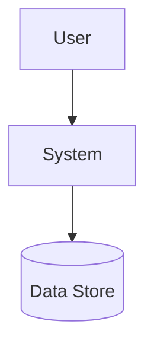
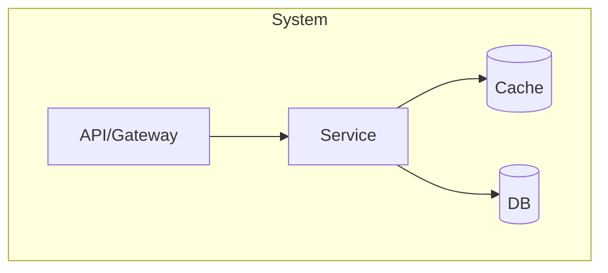
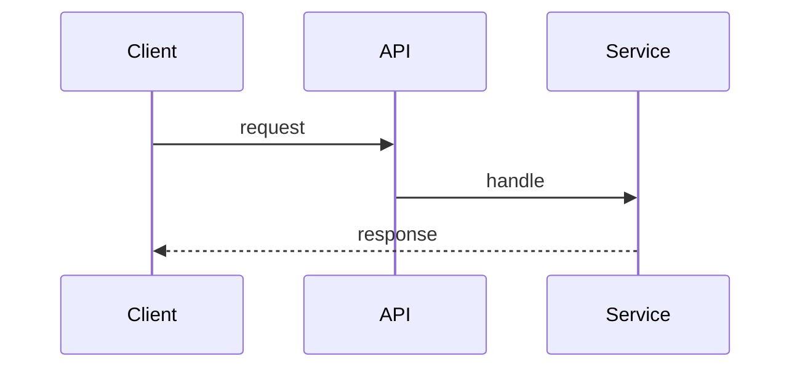
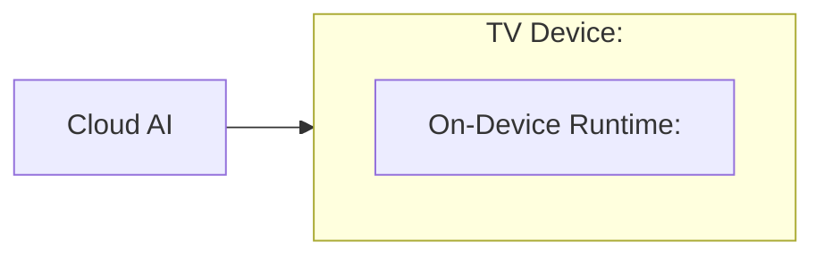

# 아키텍처 브리프 (`arch/architecture-brief.md`) — arc42 경량 + C4

## 1. Introduction & Goals
상위 품질 목표 = 우선순위 QS 요약 (QS-001 Latency, QS-002 Memory ...).

## 2. Constraints & Non-Goals

## 3. Context & Scope (C4 Context)
> 시스템 경계와 외부 의존을 보여준다.

## 4. Solution Strategy
채택 전술 요약(§D5) + 근거 ADR 링크.

## 5. Building Blocks (C4 Container → Component)
> 컨테이너/컴포넌트 분해를 보여준다.

## 6. Runtime View (latency-critical 경로)
> 핵심 시나리오의 컴포넌트 상호작용을 보여준다.

## 7. Deployment View
> 런타임 배치와 자원/메모리 배치를 보여준다.

## 8. Crosscutting Concepts
로깅/관측(SLO 측정 포인트)/에러/보안.

## 9. Architecture Decisions
- ADR 목록 링크.

## 10. Quality Requirements
우선순위 QS 요약 + latency/memory budget 표 인용.

## 11. Risks & Technical Debt
Phase 8 평가 연결.
