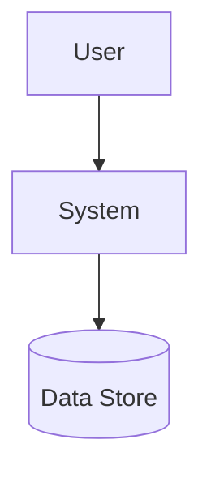
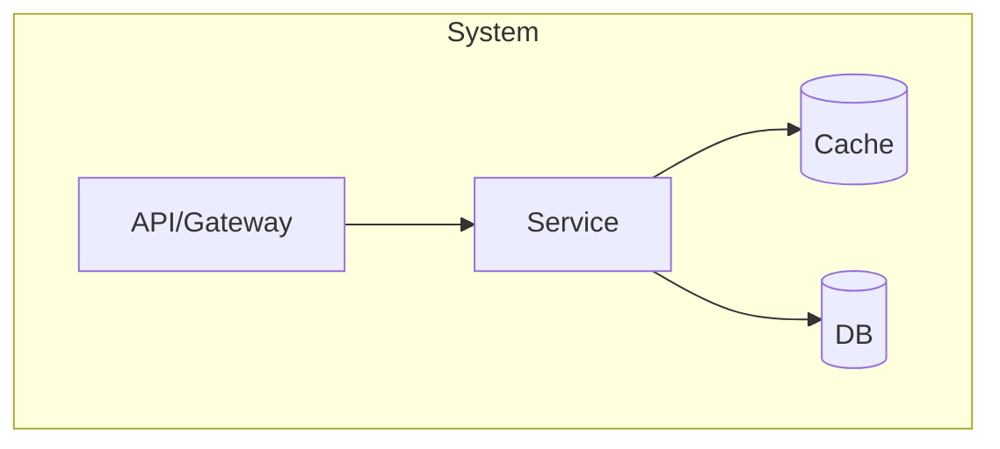
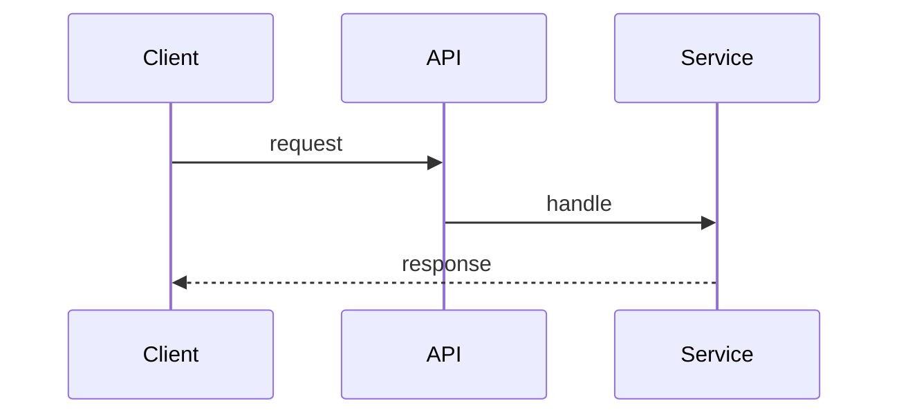
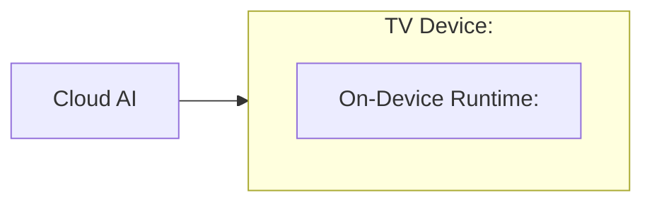

# 아키텍처 브리프 (`arch/architecture-brief.md`) — arc42 경량 + C4

## 0. 한눈에
> 모든 stakeholder를 위한 1~2문단(한국어) + Context 다이어그램. 설계 의도/선택 이유/기대 효과/영향 범위/주요 고려사항. (요약 아님 — 공유·합의용 진입점)

## 1. Introduction & Goals
상위 품질 목표 = 우선순위 QS 요약 (QS-001 Latency, QS-002 Memory ...).

## 2. Constraints & Non-Goals

## 3. Context & Scope (C4 Context)
> 시스템 경계와 외부 의존을 보여준다.

## 4. Solution Strategy
채택 전술 요약(§D5) + 근거 ADR 링크.

## 5. Building Blocks (C4 Container → Component)
> 컨테이너/컴포넌트 분해를 보여준다.

## 6. Runtime View (latency-critical 경로)
> 핵심 시나리오의 컴포넌트 상호작용을 보여준다.

## 7. Deployment View
> 런타임 배치와 자원/메모리 배치를 보여준다.

## 8. Crosscutting Concepts
로깅/관측(SLO 측정 포인트)/에러/보안.

## 9. Architecture Decisions
- ADR 목록 링크.

## 10. Quality Requirements
우선순위 QS 요약 + latency/memory budget 표 인용.

## 11. Risks & Technical Debt
Phase 8 평가 연결.

## 12. 용어 (Glossary)
| 용어/약어 | 쉬운 설명 |
|---|---|
| `<전문용어>` | `<쉬운 한 줄>` |

## 13. 이해도 테스트
> 이 문서가 다음 5문항에 답하는지 확인.
- 왜 필요한가?
- 안 하면 어떤 문제가 생기는가?
- 어떤 선택을 했는가?
- 왜 다른 선택을 하지 않았는가?
- 누가 무엇을 해야 하는가? → `arch/stakeholder-action-plan.md`

## 14. Stakeholder Responsibilities
> 누가 무엇을 하는지. 상세는 `arch/stakeholder-action-plan.md` 참조.
| Role | 해야 할 일 |
|---|---|
| CX | `<사용자 시나리오/VOC 검증>` |
| UX | `<interaction/flow 설계>` |
| PM/PO | `<scope·milestone·의존성 관리>` |
| Client | `<on-device 구현>` |
| Server/Cloud | `<API·정책 동기화 제공>` |
| QA | `<safety/test matrix>` |
| Security/Privacy | `<data boundary·redaction>` |
| Release/Ops | `<rollout·telemetry·rollback>` |
