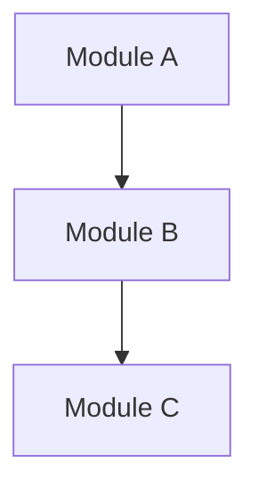

# As-Is 자산 흡수 (Phase 0) — <과제>

> **언제:** 신규(greenfield)가 아니라 **기존 과제** 위에서 통합·설계할 때. 특히 **소스 없이** 기존 설계도면·
> 흐름·모듈 설명·구두 지식만 있는 경우. 이 산출물은 to-be 설계(Phase 4~8)의 **입력 증거**이며, 결정이 아니다.
> applied_mode = `audit` (소스 없는 문서 기반) 또는 `scoped` (read-only 소스 동반)로 둔다.

## 0. 흡수 원칙 (소스 없음 = 모든 것이 가정)
- 소스로 검증할 수 없으므로 **모든 as-is 기술은 `Assumption`이고**, owner/SME 확인 후에만 `Verified`로 승격한다.
- 검증 안 된 모듈 경계·인터페이스는 자동으로 `open-questions.md` + `risk-register.md` 항목이 된다.
- 추정 성능치 금지(§A14). 기존 문서의 수치도 `arch/quality/` budget에 owner 승인으로 옮기기 전엔 `<TBD>`.

## 0. 한눈에
> 모든 stakeholder가 빠르게 파악할 1~2문단(한국어): 이 분석이 무엇을 위한 것인가. 아래 모듈맵 다이어그램을 먼저 보면 큰 그림이 잡히게.

## 1. 증거 인벤토리 (Provenance)
> 원본은 `arch/sources/originals/`에 보존, LLM-readable 정리물은 `arch/sources/normalized/`(= Source Record).
> 각 증거는 **출처와 타임스탬프**를 가진 Source Record(SRC-)로 연결한다.
| ID | Source Record | 출처(Origin) | 형태 | 원본 작성·갱신일 | 수집 시각 | 신뢰도 |
|---|---|---|---|---|---|---|
| EV-001 | [SRC-001](../sources/normalized/SRC-001-*.md) | <누가/어디> | diagram/flow/문서/구두 | `<YYYY-MM-DD>` | `<YYYY-MM-DD HH:MM>` | High/Med/Low |

## 2. As-Is 모듈 맵 (재구성)
> 기존 설계도면·모듈 설명을 일반화한 **현재 구조 가설**. 내부 식별자는 redaction tag.

*intent caption: 기존 자산 기반으로 재구성한 as-is 모듈/흐름(미검증).* 

| 모듈 | 추정 책임 | 추정 인터페이스 | 근거 EV | 가정 ID | 상태 |
|---|---|---|---|---|---|
| Module A | `<TBD>` | `<TBD>` | EV-001 | AS-001 | Assumption |

> archdev 강제: 모듈/seam 행이 채워졌으면 **근거 EV가 비어 있으면 안 된다**(근거 없는 단정 = 위반). 미확인 항목은 `assumption-register.md`의 AS-ID로 연결한다.

## 3. 통합 지점(Integration Seams) — 최우선 리스크
> 기존 모듈을 통합/연결하는 **이음새**가 가장 큰 리스크. 각 seam은 `interface-contract.md` 1건으로 승격한다.
| Seam ID | Provider(기존) | Consumer | 알려진 계약? | 근거 EV | 가정 ID | 리스크 등급 |
|---|---|---|---|---|---|---|
| S-001 | Module A | 신규 통합부 | partial/none | EV-001 | AS-002 | High/Med/Low |

## 4. As-Is → To-Be 전환 메모
- **유지(reuse):** <그대로 쓰는 부분>
- **변경(adapt):** <감싸거나 바꾸는 부분>
- **불명확(verify-first):** <Phase 4 진입 전 owner/SME 확인 필요>

## 용어 (Glossary)
| 용어/약어 | 쉬운 설명 |
|---|---|
| `<전문용어>` | `<쉬운 한 줄>` |

## Non-Goals
- as-is를 "정답"으로 고정하지 않는다(가정일 뿐).
- 이 단계에서 구현/프레임워크 결정하지 않는다.

## Closure (Phase 0 → Phase 4 게이트)
- [ ] 모든 as-is 모듈/seam이 EV 근거를 가진다.
- [ ] 검증 안 된 seam이 open-question 또는 risk로 등록되었다.
- [ ] owner가 "이 as-is 가설로 to-be 설계를 진행한다"를 승인(qna-log 기록).
