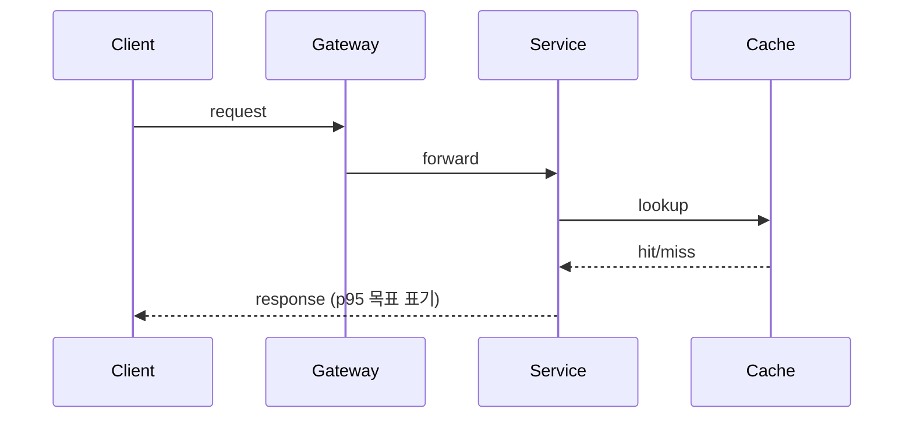
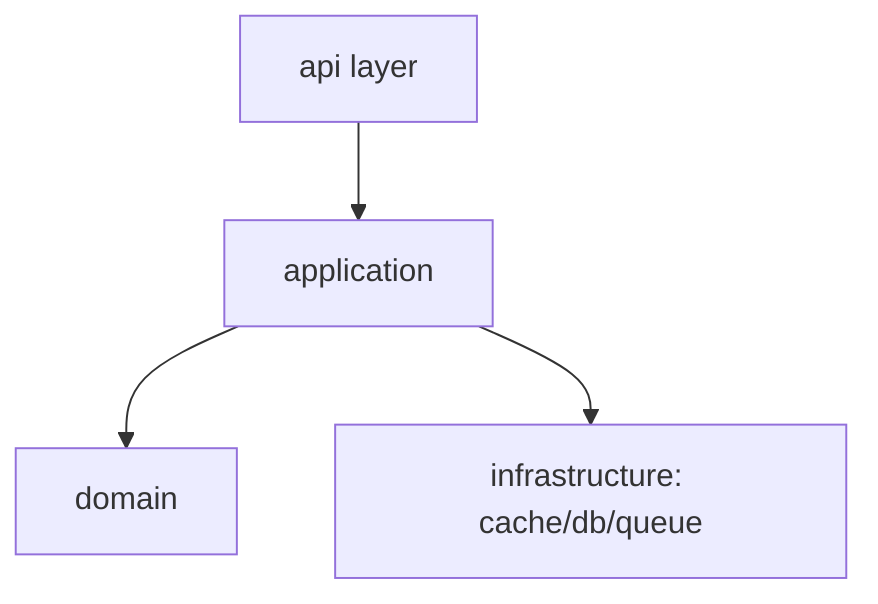

# Candidate — <후보 구조 제목> (drives QS-NNN)

- **Target QS:** [QS-NNN](...) (priority High)
- **Applied tactics:** <예: 캐싱 + CQRS read 분리 (Latency); 캐시 상한+TTL (Memory)>

## 동작(runtime) view
> 이 다이어그램은 <…> 요청이 컴포넌트를 거치는 흐름을 보여준다.

## 개발(module) view
> 이 다이어그램은 모듈/레이어 의존성을 보여준다.

## QS 영향 분석
| QS | 영향(정성) | 추정(정량) | trade-off |
|---|---|---|---|
| QS-001 Latency | ↓ | `p95 ~<TBD>` | memory 영향 `<TBD>` |
| QS-002 Memory | ↑ | `<TBD>` | budget 내 여부 |

## Non-Goals
- <이 후보가 다루지 않는 범위>
