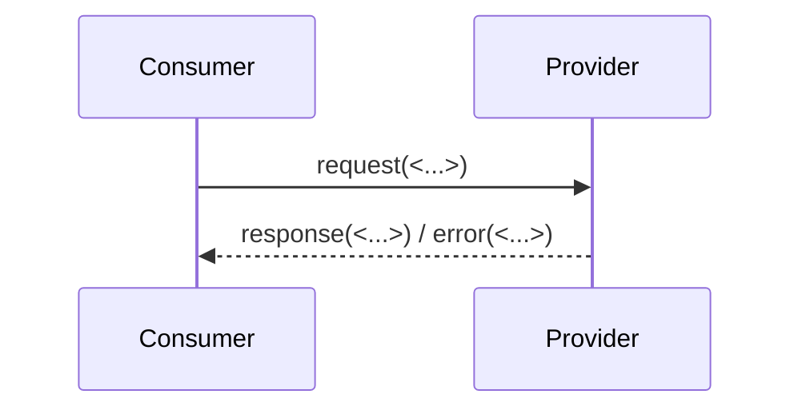

# Interface Contract — <Seam ID> (<Provider> ↔ <Consumer>)

> **언제:** 기존/신규 모듈을 통합하는 **이음새**마다 1건. (하네스의 `workflow/IO-CONTRACT.md`는 *설계 단계*
> 입출력 규약이고, 이 문서는 *제품 모듈 간* 계약이다 — 혼동 금지.) 통합 설계의 최대 리스크는 이음새이므로
> 계약을 명시·소유·추적한다.

- **Seam ID:** S-00x
- **Provider (제공):** <기존 Module A> — as-is `Assumption`/`Verified`
- **Consumer (소비):** <신규 통합부>
- **소유자(계약 책임):** <담당>
- **연결 ADR / QS:** [ADR-00x] / [QS-00x]

## 계약 (Contract)
| 항목 | 정의 | 근거 EV/ADR | 상태 |
|---|---|---|---|
| 입력 (request) | <필드/형식/단위> | EV-00x | Assumption |
| 출력 (response) | <필드/형식/단위> | | |
| 오류/예외 | <에러 모델, 타임아웃> | | |
| 성능 영향 | <연결된 latency/memory budget 인용 또는 `<TBD>`> | budget | |
| 호환성/버전 | <하위호환 정책> | | |

## 흐름

*intent caption: 이음새 정상·실패 흐름.*

## 미해결 / 리스크
- <검증 안 된 가정 → open-questions.md 링크>
- <계약 위반 시 영향 → risk-register.md 링크>

## Closure
- [ ] provider/consumer 양측이 계약에 합의(qna-log 기록).
- [ ] 성능 영향이 budget으로 추적되거나 `<TBD>` 책임자 지정.
- [ ] 미검증 항목이 risk/open-question으로 등록.
