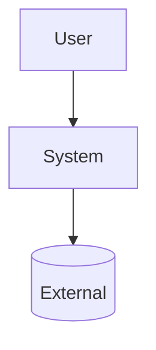

# Mermaid Cookbook — 뷰별 다이어그램 가이드 (Common §A18)

규칙: 다이어그램은 **mermaid로 markdown에 임베드**, 위에 **intent caption** 한 줄, **C4 레이어링**(Context→Container→Component).

| 뷰 | 용도 | 권장 mermaid |
|---|---|---|
| Context (C4 L1) | 시스템 경계/외부 액터 | `flowchart TD` |
| Container (C4 L2) | 배포 가능한 단위(서비스/DB/큐) | `flowchart`/`C4Container` |
| Component (C4 L3) | 컨테이너 내부 모듈 | `flowchart`/`classDiagram` |
| Runtime | 시나리오별 상호작용(특히 latency 경로) | `sequenceDiagram` |
| Deployment | 노드/자원/메모리 배치 | `flowchart LR` |
| State | 상태 전이 | `stateDiagram-v2` |
| Domain | 도메인 개념/관계 | `erDiagram`/`classDiagram` |

예시(Context):
> 이 다이어그램은 시스템과 외부 경계를 보여준다.

