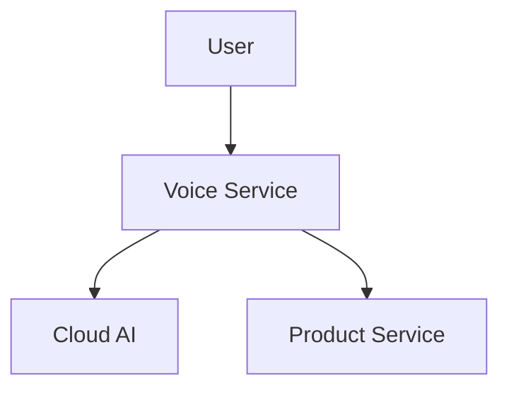
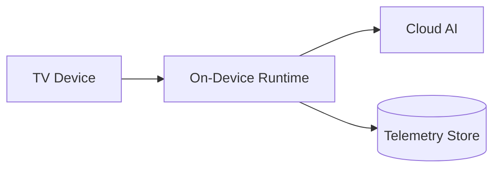
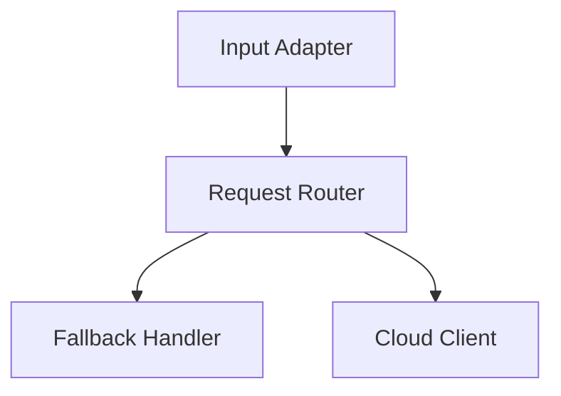
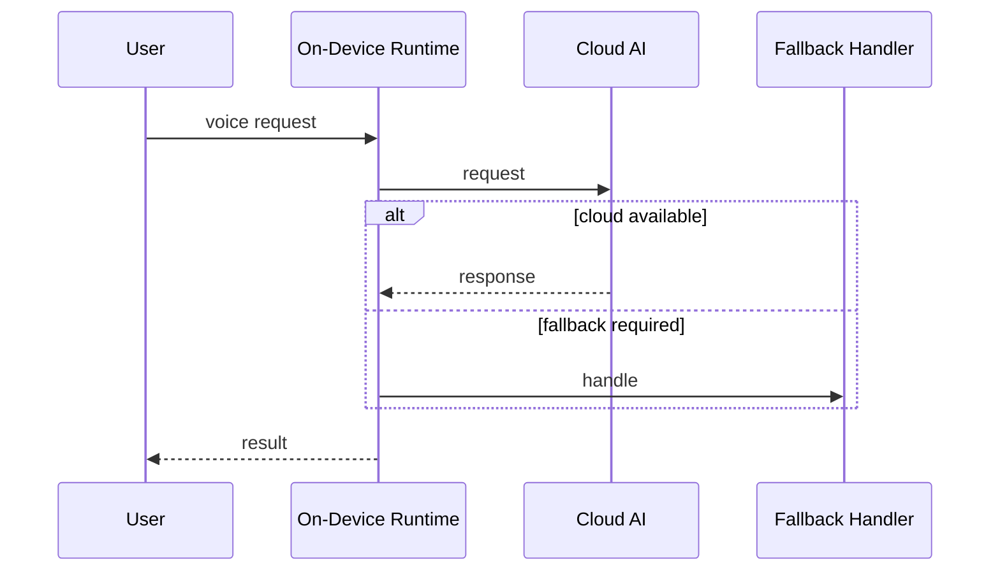
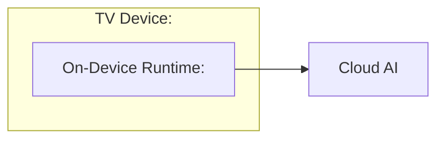
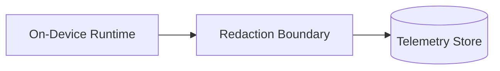
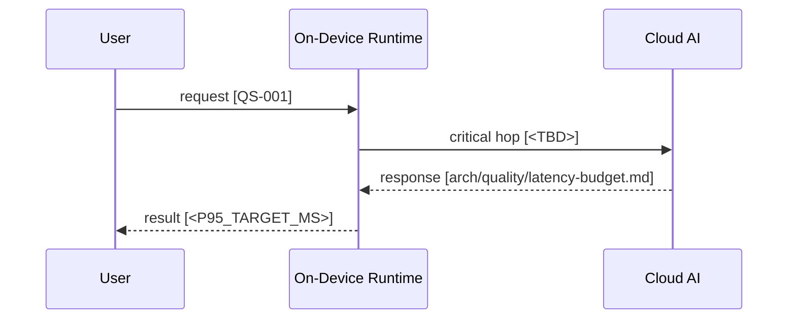
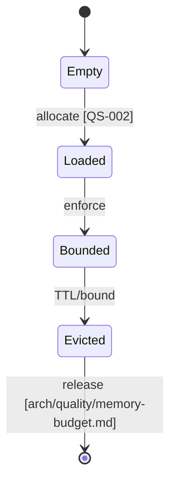

# Mermaid Cookbook — 뷰별 다이어그램 가이드 (Common §A18)

규칙: 다이어그램은 **mermaid로 markdown에 임베드**, 위에 **intent caption** 한 줄, **C4 레이어링**
(Context→Container→Component)을 적용한다.

> 다이어그램이 참조하는 text, ADR, QS와 모순되면 완료로 보지 않는다. Latency Critical Path와 Memory
> Lifecycle은 관련 QS 및 `arch/quality/` budget 링크를 반드시 포함한다.

## View Contract
| View | Purpose | Create condition | Update condition | Required nodes/participants | Required annotations | Text sync rule |
|---|---|---|---|---|---|---|
| System Context (`flowchart`) | 시스템 경계와 외부 관계 | 범위·외부 actor 식별 | 경계·외부 의존 변경 | system, actor, external system | trust/scope boundary | brief의 범위·외부 의존과 일치 |
| Container View (`flowchart`) | 배포 가능 단위와 책임 | container 후보 식별 | 단위·책임·연결 변경 | container, store, external | responsibility, protocol/data | brief/component/deployment와 일치 |
| Component View (`flowchart`) | container 내부 책임/의존성 | 핵심 책임 분해 필요 | component·의존성 변경 | component, interface | responsibility, allowed dependency | container/runtime 설명과 일치 |
| Runtime Scenario (`sequenceDiagram`) | use case 상호작용과 fallback | 핵심 runtime 시나리오 식별 | 순서·오류·fallback 변경 | actor, participant, external | use case/QS, failure branch | use case/ADR와 일치 |
| Deployment View (`flowchart`) | node/runtime/resource 배치 | 배치가 품질 드라이버임 | topology/resource 경계 변경 | node, runtime, external | environment, resource placeholder | ADR/memory budget와 일치 |
| Data Flow (`flowchart`) | source-transform-sink와 경계 | 데이터 이동·소유가 중요 | source/sink/transform 변경 | source, transform, sink | classification, boundary | security/risk text와 일치 |
| Latency Critical Path (`sequenceDiagram`) | latency High QS의 hop/측정점 | latency High QS 존재 | hop/QS/budget 변경 | actor, critical participants | QS 링크, budget 링크, `<TBD>` 측정점 | latency budget/QS와 일치 |
| Memory Lifecycle (`flowchart`/`stateDiagram-v2`) | allocate-retain-evict-release | memory High QS 존재 | cache/allocation/release 변경 | allocation, retained state, release | QS 링크, budget 링크, bound/evict | memory budget/QS와 일치 |

## Generic Non-Confidential Examples

### System Context
> 이 다이어그램은 Voice Service와 외부 경계를 보여준다.

### Container View
> 이 다이어그램은 Voice Service의 배포 가능한 단위를 보여준다.

### Component View
> 이 다이어그램은 On-Device Runtime의 책임 분해를 보여준다.

### Runtime Scenario
> 이 다이어그램은 음성 요청의 정상·fallback 상호작용을 보여준다.

### Deployment View
> 이 다이어그램은 일반화된 runtime 배치와 자원 placeholder를 보여준다.

### Data Flow
> 이 다이어그램은 redacted telemetry 데이터 흐름을 보여준다.

### Latency Critical Path
> 이 다이어그램은 QS-001과 latency budget이 관리하는 critical path를 보여준다.

### Memory Lifecycle
> 이 다이어그램은 QS-002와 memory budget이 관리하는 cache lifecycle을 보여준다.

