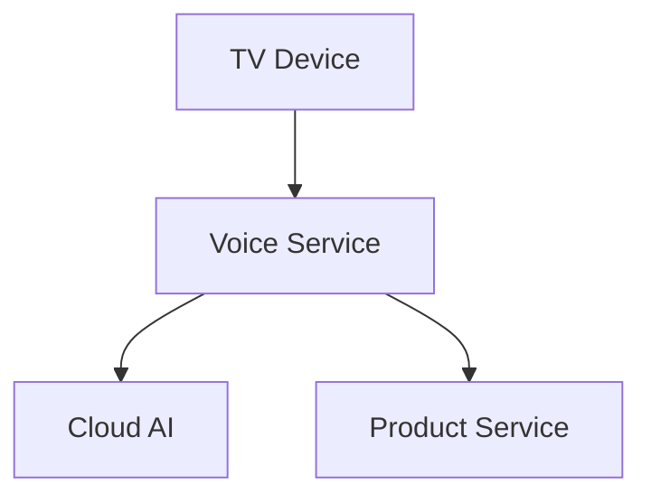

# Scoped Architecture Brief — <slice>

## Analysis Intent
<분석 질문과 기대 결정>

## Scope & Boundaries
`scope.md` 링크. 내부 경로와 식별자는 redaction tag를 사용한다.

## Drivers & Non-Goals
- <driver>
- <Non-Goal>

## Structural Summary
> 이 다이어그램은 분석 대상과 허용된 외부 경계를 일반화해 보여준다.

## Evidence Links
- <redacted evidence reference>
