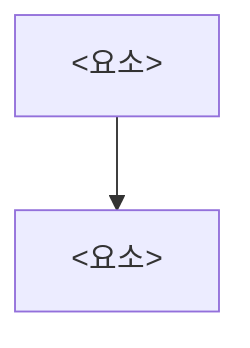

# Source Record — <SRC-001 제목>

> **원본은 그대로 보존**(`arch/sources/originals/`), 이 파일은 그 원본을 **읽기 좋게 정리한 별도 산출물**이다.
> 정리물 ≠ 원본. **요약이 아니라** 이 자료가 설계에 주는 영향을 분석한 문서다(아래 "설계 영향" 필수).
> **작성 언어: 한국어**(기술 용어만 영어 유지). 출처와 타임스탬프를 반드시 표기한다.

- **Source ID:** SRC-001
- **출처(Origin):** `<누가/어느 시스템/어느 문서 — 사람·팀·문서명>`
- **원본 위치(Original):** `arch/sources/originals/<file>` (업로드 불가 시: `<위치/접근 방법 포인터>`)
- **원본 작성·갱신일(Original modified):** `<YYYY-MM-DD 또는 unknown>`
- **수집 시각(Captured-at):** `<YYYY-MM-DD HH:MM — 이 정리물 생성 시점>`
- **신뢰도(Confidence):** `<High/Med/Low>`
- **Redaction:** `<none / redacted(무엇을)>`
- **연결 근거(EV/AS):** `<EV-001 / AS-001>`

## 한눈에 (왜 중요한가)
> 모든 stakeholder가 빠르게 파악할 1~2문단(한국어). 이 자료가 **무엇이고, 현재 프로젝트에 어떤 의미인지**.
<이 자료가 왜 중요하고 설계에 어떤 의미인지>

## 핵심 내용 (정리물, LLM-readable)
> 원본을 구조화해 재정리(표/리스트). 줄글 덩어리 금지. 요약 아님 — 설계에 필요한 사실을 빠짐없이.
- <항목>

## 구조 / 흐름
> 도면·흐름은 mermaid로. (구조적 내용이 있으면 필수)

## 용어 (Glossary)
| 용어/약어 | 쉬운 설명 |
|---|---|
| `<전문용어>` | `<쉬운 한 줄 설명>` |

## 설계 영향 (Source-to-Design Impact)
> 단순 요약 금지. 이 자료가 설계 산출물에 어떤 요구사항/제약/위험/가정/결정을 강제하는지 적는다.

### Requirements Extracted
| ID | Requirement | Evidence | Required Artifact |
|---|---|---|---|
| REQ-001 | `<요구사항>` | `<원문 근거/쪽/문장>` | `<arch/usecases/... 또는 arch/quality/...>` |

### Constraints Extracted
| ID | Constraint | Evidence | Architecture Impact |
|---|---|---|---|
| CON-001 | `<제약>` | `<근거>` | `<영향>` |

### Risks / Assumptions / Open Questions
| Type | ID | Item | Owner / 확인 대상 | Required Artifact |
|---|---|---|---|---|
| Risk | R-001 | `<위험>` | `<Owner>` | `arch/evaluation/risk-register.md` |
| Assumption | AS-001 | `<가정>` | `<확인 대상>` | `arch/assumptions/assumption-register.md` |
| Open Question | OQ-001 | `<질문>` | `<확인 대상>` | `arch/evaluation/open-questions.md` |

### Architecture Impact
- Affected components/views: `<TBD>`
- Candidate decision needed: `<Yes/No; ADR candidate>`
- Stakeholder action needed: `<CX/UX/QA/Client/Server/Security/Ops/...>`
- Coverage update: `workflow/artifact-coverage-matrix.md`에 Required Artifact를 등록한다.

## 원본과의 차이 · 주의
- <정리하며 해석/생략/가정한 부분 = 원본을 직접 봐야 하는 지점>
