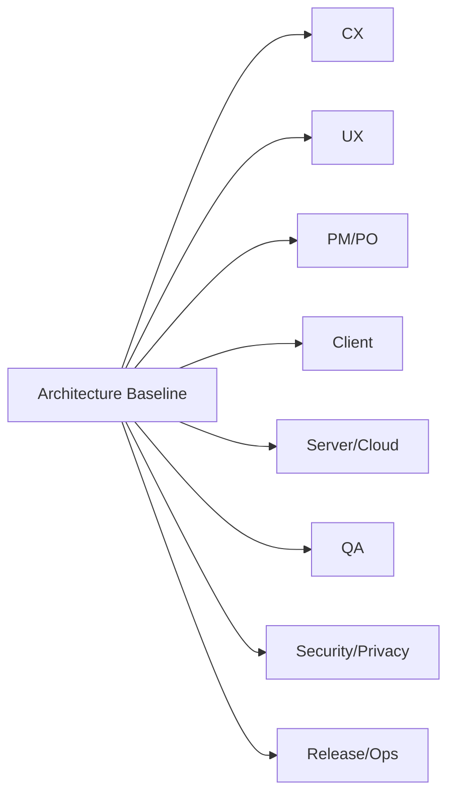

# Stakeholder Action Plan — <과제>

> 설계 결과를 실제 조직 실행으로 나누는 담당자별 action plan. Architecture Baseline 후 "누가 무엇을 해야
> 하는가"에 바로 답해야 한다. **한국어로 작성**. (이해도 테스트 5번 질문에 답하는 산출물)

## 한눈에
이 문서는 설계 결과를 담당자별 실행 항목으로 나눈 것이다. 각 팀이 무엇을, 무엇을 입력받아, 무엇을 산출하고,
무엇에 의존하며, 언제 완료로 보는지를 한 표로 정렬한다.

## Role Map

*intent caption: Baseline에서 갈라지는 팀별 실행 책임.*

## 담당자별 실행 항목
| Role / Team | 해야 할 일 | 입력 산출물 | 출력 산출물 | Dependency | 완료 기준 |
|---|---|---|---|---|---|
| CX | `<고객 여정·VOC·실패경험 검토>` | Architecture Brief, UX scenarios | `<CX validation notes>` | UX, PM | `<핵심 시나리오 승인>` |
| UX | `<confirmation·fallback·flow 설계>` | Stakeholder Summary, QS | `<UX flow/wireframe>` | CX, Client | `<주요 flow 승인>` |
| PM/PO | `<scope·milestone·release 경계>` | Decision Dashboard, Risk Register | `<scope/milestone>` | 전체 | `<scope freeze>` |
| Client | `<on-device 컴포넌트/API/권한/저장 설계>` | Architecture Description, ADR | `<component design/task>` | UX, Server, QA | `<dev-ready 분해>` |
| Server/Cloud | `<정책 동기화·metadata/API 검토>` | Interface Contract, ADR | `<API spec/data contract>` | Client, Security | `<contract review 완료>` |
| QA | `<functional·regression·safety 설계>` | QS, Risk Register | `<test matrix/quality gate>` | Client, UX | `<P0/P1 test set>` |
| Security/Privacy | `<data boundary·logging·redaction 검토>` | Source records, Risk Register | `<security/privacy review>` | Client, Server | `<blocking risk 없음>` |
| Release/Ops | `<rollout·telemetry·rollback 설계>` | Evaluation, Risk Register | `<launch checklist>` | PM, QA | `<launch gate 정의>` |

## Open Allocation Issues
| Issue | Affected Role | Decision Needed | Owner | Due |
|---|---|---|---|---|
| `<TBD>` | `<Role>` | `<결정 필요>` | `<Owner>` | `<Date>` |

## 용어
| 용어 | 설명 |
|---|---|
| Action Plan | 설계 결과를 담당자별 실행 항목으로 나눈 문서 |
| Dependency | 해당 팀이 시작/완료에 필요한 입력·선행 결정 |
