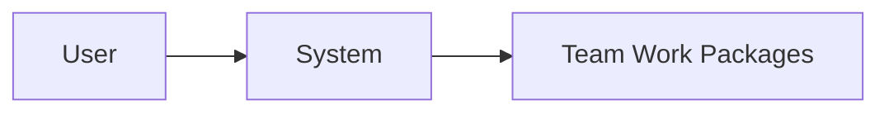

# Stakeholder Summary — <Project>

## 한눈에
<임원/PM/CX/UX/QA/개발자가 2분 안에 이해할 수 있는 한국어 요약. 기술 용어는 English 유지.>

## 왜 필요한가
- <Business / customer / technical driver>

## 무엇을 결정했는가
| Topic | Decision | Why | Impact | ADR |
|---|---|---|---|---|
| `<Topic>` | `<Decision>` | `<Reason>` | `<Team/User impact>` | `<ADR-xxx>` |

## 팀별 해야 할 일
| Team | Action | Output | Needed By |
|---|---|---|---|
| CX | `<TBD>` | `<TBD>` | `<Date/Phase>` |
| UX | `<TBD>` | `<TBD>` | `<Date/Phase>` |
| PM/PO | `<TBD>` | `<TBD>` | `<Date/Phase>` |
| Client | `<TBD>` | `<TBD>` | `<Date/Phase>` |
| Server/Cloud | `<TBD>` | `<TBD>` | `<Date/Phase>` |
| QA | `<TBD>` | `<TBD>` | `<Date/Phase>` |
| Security/Privacy | `<TBD>` | `<TBD>` | `<Date/Phase>` |

## 주요 리스크
| Risk | Owner | Mitigation |
|---|---|---|
| `<TBD>` | `<Owner>` | `<Mitigation>` |

## 구조 요약

## 용어
| 용어 | 쉬운 설명 |
|---|---|
| `<Term>` | `<Explanation>` |
