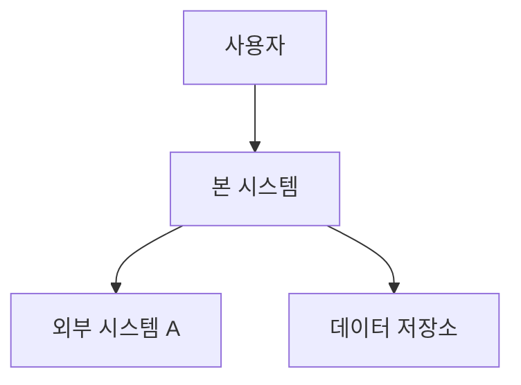

# 시스템 정의 (system.md)

## 1. 목적 & 범위
<무엇을 왜 만드는가>

## 2. 비즈니스 드라이버
- <상품화 목표, 핵심 KPI — latency/memory가 비즈니스에 왜 중요한지 포함>

## 3. 이해관계자
| 이해관계자 | 관심 품질 |
|---|---|

## 4. 제약 (Constraints)
- 기술/조직/규제/예산 제약

## 5. Non-Goals (명시적 비범위, §A16)
- <지금 풀지 않는 것 / out-of-scope 품질>

## 6. 컨텍스트 다이어그램 (C4 Context)
> 이 다이어그램은 시스템과 외부 액터/시스템의 경계를 보여준다.

