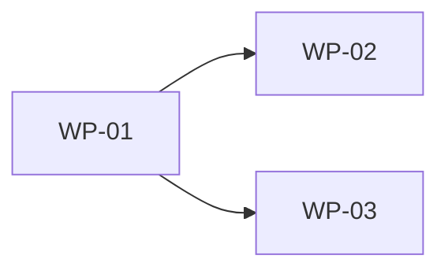

# Work Breakdown & 할당 — <마일스톤>

> **언제:** Design Baseline(§D8) 승인 후, 채택된 **module view**와 ADR을 **할당 가능한 작업 패키지**로 분해할 때.
> 파트 리더의 산출물이며, 각 패키지는 accepted ADR과 traceability로 연결된다. 코드가 아니라 **할당 단위**다.

## 1. 작업 패키지 (Work Packages)
| WP ID | 패키지(모듈/이음새) | 담당 | 의존 WP | 드라이버 QS/ADR | 인터페이스 계약 | 리스크 | 준비도(DoR) | 완료기준(DoD) |
|---|---|---|---|---|---|---|---|---|
| WP-01 | <Module B 통합> | <담당자> | — | QS-001 / ADR-003 | [S-001](interface-contract.md) | R-001 | 계약 확정 | 계약 충족+평가 PASS |
| WP-02 | <Module C 어댑터> | <담당자> | WP-01 | QS-002 / ADR-004 | [S-002] | R-002 | as-is 검증 완료 | <TBD> |

## 2. 의존 순서 / 크리티컬 패스
> 설계 흐름(8 phase)이 아니라 **구현 작업** 순서. ADR/인터페이스 의존으로 위상정렬.

*intent caption: WP 의존 그래프 — 굵은 경로가 크리티컬 패스.*

## 3. 할당 원칙
- 한 WP = 한 담당(공동책임 금지). 이음새(seam) WP는 provider/consumer **양쪽 담당**을 명시.
- High QS를 건드리는 WP는 착수 전 **인터페이스 계약 합의**가 DoR.
- 미검증 as-is에 의존하는 WP는 `verify-first` WP를 선행 의존으로 둔다.

## 4. 추적성 연결
각 WP는 `workflow/traceability-matrix.md`의 QS→ADR→view 행과 1:1로 연결되어야 한다.
연결 없는 WP는 "근거 없는 작업"으로 반려.

## Closure
- [ ] 모든 High-QS ADR이 최소 1개 WP로 커버됨.
- [ ] 모든 WP가 담당·의존·DoD를 가짐.
- [ ] 크리티컬 패스가 식별되고 owner가 일정 리스크를 확인함.
