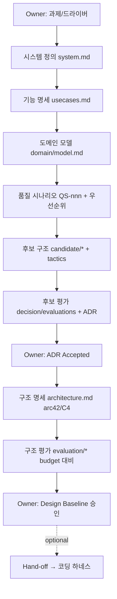

# 산출물 입출력 계약 (I/O Contract) — Arch Harness

설계 단계별 산출물 종속성과 핸드오프 검증 요건. 코딩 게이트가 아니라 **설계 게이트** 다.

## 핸드오프 검증 체크리스트
- **품질 시나리오 준비.** 각 우선순위 QS가 6-part로 완성, response measure가 budget 수치 인용, 우선순위·근거 명시.
- **후보 구조 준비.** 우선순위 QS별 후보가 동작/개발 view로 분리, 적용 전술과 trade-off 명시, ≥2 옵션.
- **결정 준비.** ADR이 driver matrix(QS 열 포함)와 Decision brief 보유, owner 승인 전에는 architecture.md 반영 금지.
- **Design Baseline 게이트(§D8).** 우선순위 QS 전부 traceability 완결 + architecture.md C4/runtime/deployment 다이어그램 + budget 표 채움 + Phase 8 평가 + `archdev check` PASS.
